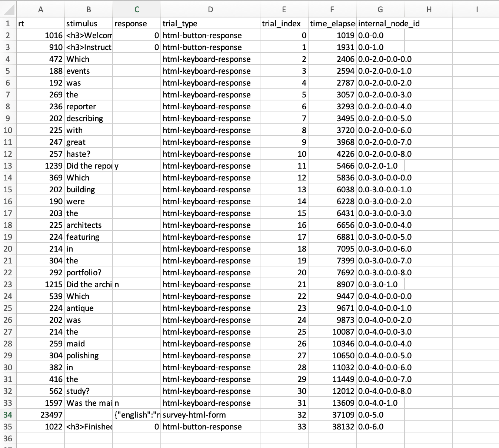

### How would you add extra trials to this code, i.e. additional sentences and related comprehension questions? 

This should be pretty easy and involves two steps: 
1. Using the `make_spr_trial` function to create a trial (you can copy and paste the example code then edit the sentence and the question).
2. Add the new trial to the timeline. 

So for example: the last judgment trial in the code you were given looks like this:

```js
var spr_trial_2 = make_spr_trial(
  "Which building were the architects featuring in the portfolio?",
  "Did the architects have a portfolio?"
);
```

and the timeline looks like this, with `spr_trial_2` slotted in at the end:

```js
var full_timeline = [
  consent_screen,
  instruction_screen_1,
  spr_trial_1,
  spr_trial_2,
  demographics_form,
  final_screen,
];
```

We can create a new trial, which we could call `spr_trial_3`, like this:

```js
//An extra trial
var spr_trial_3 = make_spr_trial(
  "Which antique was the maid polishing in the study?",
  "Was the maid vacuuming?"
);
```

and add it at the end of the timeline:

```js
var full_timeline = [
  consent_screen,
  instruction_screen_1,
  spr_trial_1,
  spr_trial_2,
  spr_trial_3, //added here
  demographics_form,
  final_screen,
];
```

### Add another demographics question, e.g. a text box to list other languages spoken, or some additional radio buttons with more than 2 options.

This is going to involve messing with the `demographics_form` trial, which looks like this:

```js
var demographics_form = {
  type: jsPsychSurveyHtmlForm,
  preamble:
    "<p style='text-align:left'> Please answer a few final questions about yourself and our experiment.</p>",
  html: "<p style='text-align:left'>Are you a native speaker of English?<br>  \
            <input type='radio' name='english' value='yes'>yes<br>\
            <input type='radio' name='english' value='no'>no<br></p> \
        <p style='text-align:left'>What is your age? <br> \
            <input required name='age' type='number'></p> \
        <p style='text-align:left'>Any other comments?<br> \
            <textarea name='comments'rows='10' cols='60'></textarea></p>",
};
```

As explained in the notes, the `html` parameter has several parts which present the 3 questions in the basic form. The code for the textbox is at the end:

```js
      "...       \
      <p style='text-align:left'>Any other comments?<br> \
      <textarea name='comments'rows='10' cols='60'></textarea></p>",
```

So if we wanted to add a text box about languages, we could just copy this template, modifying it to ask the question we want:

```js
      "...       \
      <p style='text-align:left'>Please list the languages you speak fluently.<br> \
      <textarea name='languages'rows='10' cols='60'></textarea></p>",
```

Notice that we have changed the `name` of the textarea so that when we display the data at the end we can tell which answers are general comments and which are lists of languages.

We could do the same thing with the radio buttons. Here is the code for the existing radio buttons:

```js
      "<p style='text-align:left'>Are you a native speaker of English?<br>  \
            <input type='radio' name='english' value='yes'>yes<br>\
            <input type='radio' name='english' value='no'>no<br></p> \
            ..."
```

So there's a question at the top, then one row per option; to group the radio buttons each row has the same `name` but a different `value`. So we can just copy this basic design, e.g.:

```js
      "...\
      <p style='text-align:left'>How many languages do you speak fluently?<br>  \
            <input type='radio' name='number_of_languages' value='1'>One<br>\
            <input type='radio' name='number_of_languages' value='2'>Two<br>\
            <input type='radio' name='number_of_languages' value='3'>Three or more</p> \
            ..."
```

Here's what the extended demographics trial would look like with those additions dropped in to the `html` parameter.

```js
var demographics_form = {
  type: jsPsychSurveyHtmlForm,
  preamble:
    "<p style='text-align:left'> Please answer a few final questions about yourself and our experiment.</p>",
  html: "<p style='text-align:left'>Are you a native speaker of English?<br>  \
            <input type='radio' name='english' value='yes'>yes<br>\
            <input type='radio' name='english' value='no'>no<br></p> \
        <p style='text-align:left'>What is your age? <br> \
            <input required name='age' type='number'></p> \
        <p style='text-align:left'>How many languages do you speak fluently?<br>  \
            <input type='radio' name='number_of_languages' value='1'>One<br>\
          <input type='radio' name='number_of_languages' value='2'>Two<br>\
          <input type='radio' name='number_of_languages' value='3'>Three or more</p> \
        <p style='text-align:left'>Please list the languages you speak fluently.<br> \
      <textarea name='languages'rows='10' cols='60'></textarea></p>\
        <p style='text-align:left'>Any other comments?<br> \
            <textarea name='comments'rows='10' cols='60'></textarea></p>",
};
```


### If you were going to analyse this kind of data, you would need to pull out the relevant trials (i.e. the ones involving self-paced reading, and comprehension questions). Is it going to be easy to do that based on the kind of output the code produces? How would you identify those trials? If you were particularly interested in certain words in certain contexts, is it going to be easy to pull those trials out of the data the code produces?

Here's what the data looks like after I paste it into Excel and format it a bit:



It's going to be reasonably easy to identify the self-paced reading and comprehension trials because those are the only trials that have "html-keyboard-reesponse" in the trial_type column. And I could differentiate the reading trials and the comprehension trials by looking at the response column - the reading trials all have " " as the response (a space!), the comprehension questions all have "y" or "n". But it would be nice to make my life easier by adding an extra column to my data that made it easier to pick out trial types I want, without having to rely on so much in-depth knowledge of the structure of the experiment - we'll see how to do that in the next practical. And currently it'd be very difficult to pull out critical words or sequences of words from this data (e.g. the words following the verb) - there's no marker in the data that would help me do that.


### - [Optional, very challenging] An alternative to self-paced reading is the Maze task...

[We provide notes on this](oels_practical_wk4_maze.md).

## Re-use

All aspects of this work are licensed under a [Creative Commons Attribution 4.0 International License](http://creativecommons.org/licenses/by/4.0/).
