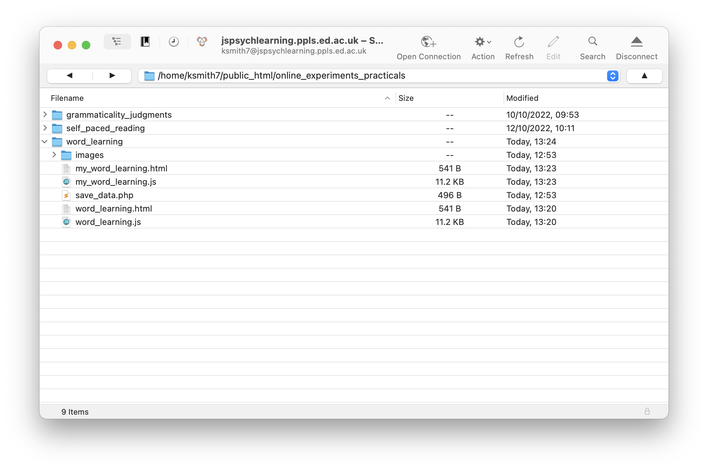

# The plan for week 6 practical

This week we are going to look at a bit more of the [Online Experiments with jsPsych tutorial](https://softdev.ppls.ed.ac.uk/online_experiments/index.html), and then look at code for a simple word learning / frequency learning experiment based on the Ferdinand et al. (2019) paper we read this week. Our implementation of this experiment builds on the self-paced reading experiment in that it uses nested timelines and functions to construct trials which have a fairly complex structure (although you can implement it more simply than that). It also requires randomisation and contingent trials (what the participant sees on one trial depends on what they did at the previous trial), so we need to introduce some infrastructure to do that. Finally, I'll add some code to filter experiment data and record the important data on the server at the end of the experiment, rather than just dumping it to the screen.

Remember, as usual the idea is that you can work through these practicals in the lab classes and, if necessary, in your own time - I recommend you use the lab classes as dedicated time to focus on the practicals, with on-tap support from the teaching team, but if you don't get through everything in lab time you should do at least some work in your own time to keep up to speed. There is quite a lot of new technical content this week, next week will be less intense!

# Tutorial content

Read through [section 06 of the Online Experiments with jsPsych tutorial](https://softdev.ppls.ed.ac.uk/online_experiments/06_data.html) - you can stop when you get to the section titled "Sending the data line by line" since we'll cover this next week and we'll be using a slightly different technique than Alisdair covers in his tutorial. You don't need to do the exercises dotted through the tutorial, since we will see the same bits of code in the word learning experiment. The key things you need to take away from the tutorial are:
- You don't have to understand the details of how the POST and PHP stuff works to save the data, just that it's possible and it works.
- You can save data to the server either at the end of the experiment, which is what I have implemented in the word learning code, or after every trial (which we will get to later in the course). **Saving data trial-by-trial is better**, so if you need to write code where you actually care about reliably getting the data (e.g. for a dissertation project) we recommend you use that method once we have shown it to you. Waiting to the end of the experiment to save the data can be risky, because if there's a technical glitch you might not get any data at all (and those glitches can happen frequently - e.g. we have had students who have had problems with this on Prolific, due to the method by which participants get redirected to Prolific after they complete your study, which interferes with saving the data). Plus if you save data trial-by-trial, then if a participant contacts you to tell you they got part-way through the experiment then their computer died you can actually verify this, pay them accordingly and also have some of their data. So the save-at-the-end method we are showing you today is inferior, but it's slightly simpler, and we are trying to introduce the complexity incrementally. 
- The `data` property of jsPsych trials. Each trial has a `data` parameter which is populated by the code automatically depending on what the participant does during the trial - e.g. on an `html-button-response` trial it records the index of the button the participant pressed (0 for the first choice, 1 for the second choice, etc) in `data.response`. But we can also add to the `data` parameter ourselves - we can add information about the participant to every trial (e.g. their ID number), or we can add specific bits of data to certain trials (in the tutorial Alisdair gives the example of marking up trial type to allow you to separate 'boring' trials from important ones). In the word learning experiment we'll use the same technique to mark up important trials for later data filtering, but we'll also use the `data` property to record which label the participant clicked on (rather than just the button index, which is recorded automatically under `data.response`), which we can then use to handle cases where the response at one trial affects what happens at the next trial.

# A word learning experiment

## First: you build it!

As with last week, we'd like to give you an opportunity to try to build (parts of) this word-learning experiment yourself. As with last week, to help you get started, we are going to provide you with a couple of templates to fill in - an html file that loads some of the plugins you will need (but once you decide what additional plugins you need you will have to load them too), then a javascript file where you can put your own code. That javascript file includes some extra stuff (instructions, saving data to the server) that we pre-built for you so you can focus on the more interesting parts of the experiment.

You are actually going to need a bunch of files for this experiment - the html and javascript templates for your attempt (which we are calling `my_word_learning.html` and `my_word_learning.js`), the html  and js file for our implementation, but also a php file (for saving data) and a folder containing a bunch of images. Rather than downloading these separately, download the following zip file and then uncompress it into your usual jsPsych folder, in a folder called something like `word_learning`, alongside your `grammaticality_judgments` and `self_paced_reading` folders. :
- <a href="code/word_learning.zip" download> Download word_learning.zip</a>

This code should run on your local computer or you can upload the whole `word_learning` folder to the `public_html` folder on the jspsychlearning server and play with it there. Note that the code for that saves the data to the server will only work if your code is actually running on the jspsychlearning server - if you are running it on your own computer the data will not save anywhere, although it will still be shown on-screen. This is because your personal computer isn't running anything that can handle POST commands and process them with PHP, which is what is involved in saving data - those things are all set up on the jspsychlearning server for you. So if you haven't already got to grips with putting your code on the server, try it now. Here's what my `public_html/online_experiments_practicals/` folder currently looks like on cyberduck.



If your directory structure is the same as mine the url for your experiment will be https://jspsychlearning.ppls.ed.ac.uk/~UUN/online_experiments_practicals/word_learning/my_word_learning.html where UUN is your UUN). 

If you want to see what the finished experiment will look like, you can run the `word_learning.html` file which includes our final implementation - if you put everything on jspsychlearning, the URL will be https://jspsychlearning.ppls.ed.ac.uk/~UUN/online_experiments_practicals/word_learning/word_learning.html. Remember that if you look at the data display at the end that will include spoilers on how to write the code yourself, so depending on how much you want to challenge yourself you might want to avoid clicking through to the data! 

If you run through the experiment you'll see that, in addition to the usual instructions, you'll see that the experiment consists of two stages: *observation* and *production*.  Observation trials involve presentation of an object plus a label; production trials show the prompt the participant to select a label for an object. In a little more detail:

- Each observation trial consists of 2 steps: display the object for 1 second, then display the object plus a label for 2 seconds.

- Each production trial consists of 2 steps: display the object plus two labels and have the participant select a label, then have the participant confirm their label choice with a further click (which serves to centre their cursor, to prevent them mashing through the experiment too fast by clicking continually on one side). *When you implement production trials yourself, you can skip this second step of production trials* - it involves some additional technical machinery that is relatively hard to figure out yourself (although if you want to have a go, you can look at the jsPsych documentation on [dynamic parameters](https://www.jspsych.org/7.3/overview/dynamic-parameters/)).

(NB. Ferdinand et al. have a 3rd stage at the end of each production trial where you then see the object plus the selected label for 2 further seconds - I have not included that in the code here, I don't think it's crucial and I couldn't make it look nice in jsPsych without making everything else much more complicated!).

If you are going to attempt this yourself, you need to figure out what plugin(s) you need for observation and production trials (think about the stimulus and the response), then look at [the documentation](https://www.jspsych.org/7.3/plugins/list-of-plugins/) for that plugin to see how to use it and/or edit previous bits of code you have written that do something similar. The novel-object images you need are in the folder `images`.

Remember, it's OK to implement this in a very simple way, with a long manually-constructed trial list (which is probably a good way to start) - but if you feel more adventurous and want to use some of the ideas that were introduced last week (nested timelines, even functions to build trials) that's great too. Give it a go, see how you get on, and ask for help if/when you get stuck!

## Walk-through of our implementation

As you hopefully figured out when you were trying to build it yourself, the main part of the experiment uses a plugin you may not have used before (`image-button-response`), but you have used other `image` plugins (e.g. in the "hello world" exercise you used `image-keyboard-response` to display an image), and you have seen lots of `button-response` plugins (e.g. `html-button-response` for instruction screens). Our implementation uses those plugins, but we are going to add some extra machinery to randomise the placement of choices on-screen, and to allow the choices on one trial to depend on choices made at the previous trial (to get the click-to-confirm behaviour). 

### Nested timelines again

Like in the self-paced reading experiment, individual trials in this word-learning experiment are somewhat complex - they involve a couple of steps. Complex multi-part trials should sound familiar from the self-paced reading experiment, and we are going to handle it in the same way, by using nested timelines - the only difference is that each trial in the nested timeline in the self-paced reading experiment was essentially the same (see a word, press space) whereas here the component trials differ a little more here. But in our implementation we are also going to do some stuff with `data` property of each trial, so we'll start there.

### Trial data

You should by now be familiar with the idea that each jsPsych trial has some properties that we can set - the trial `type` (html with keyboard response, image with button response etc), the valid `choices`, the `trial_duration` etc. In the same way, each trial has a `data` property. By default the `data` property is populated automatically by the plugin, and records data relevant to that trial type - for each plugin you'll notice there's a section of the documentation telling you what it records, for instance I can see from [the image-button-response documentation](https://www.jspsych.org/7.3/plugins/image-button-response/) (which is the plugin that we'll be using in this experiment) that it records reaction time and the index of the button that the participant pressed. But we are also allowed to add stuff to the `data` property, to augment this automatically-generated content.

In this experiment we are going to use this `data` property in two ways. First, we are going to flag trials which actually contain important data. You will have already noticed that jsPsych gathers data on *all* trial types, including things like reaction times and stimulus on the consent and information screens. Recording everything is a good way to avoid losing anything, but it does make for quite a cluttered data structure at the end of the experiment. For certain critical trials in this experiment, we are going to add some information to the trial data, a `block` property, indicating trials that belong to the experiment phases/blocks that we really care about (what the participant saw on an observation trial, what they selected on a production trial); marking up those trials in that way will make it easy to find the important data at the end of the experiment, or later on when you are analysing your data.

Second, the `data` from one trial sticks around as the rest of the experiment runs. We can therefore look at the `data` property of earlier trials when constructing a new trial, which allows us to build sequences of trials where what the participant does at one trial (e.g. which button they clicked) affects what they see at the next trial: we look at the `data` from the earlier trial, extract the info we want, then use that to build the new trial.

### Observation trials

OK, let's get started with the code. Remember that each observation trial consists of 2 steps: display the object (an image) for 1 second, then display the object plus a label (some text) for 2 seconds. There are several ways you could do this in jsPsych, most obviously using the `image-keyboard-response` or `image-button-response` plugins - since we will need buttons later, I am going to use the `image-button-response` plugin.

Again, the simplest way to do this would be to construct each sub-part of each observation trial as a stand-alone trial, and then stick them together into a simple flat timeline. For instance, if I want to show `object4` (a shiny cylinder thing) paired with the label 'buv' then the label 'cal' I could do something like this:

```js
var observation_object4_only = {
  type: jsPsychImageButtonResponse,
  stimulus: "images/object4.jpg",
  choices: [],
  trial_duration: 1000,
};

var observation_object4_buv = {
  type: jsPsychImageButtonResponse,
  stimulus: "images/object4.jpg",
  choices: [],
  prompt: "buv",
  trial_duration: 2000,
};

var observation_object4_cal = {
  type: jsPsychImageButtonResponse,
  stimulus: "images/object4.jpg",
  choices: [],
  prompt: "cal",
  trial_duration: 2000,
};

var simple_observation_trials = [
  observation_object4_only,
  observation_object4_buv,
  observation_object4_only,
  observation_object4_cal,
  observation_object4_only,
  observation_object4_buv,
  observation_object4_only,
  observation_object4_buv,
  observation_object4_only,
  observation_object4_cal,
];
```
Then if we slot that `simple_observation_trials` into our timeline we will get the trial sequence we want.

A couple of things to note here.
- My `choices` are set to `[]` (an empty array), which means the participant cannot provide a response (there are no buttons shown on screen) - that's fine, since we just want them to watch and learn on these observation trials. 
- The `stimulus` parameter points to a particular image file, in the `images` folder, which you will see matches the directory structure I am using. Keeping your stimuli separate from your code keeps things nice and neat and is essential if you are building an experiment with hundreds or thousands of stimuli - you don't want to be scrolling through all of those hunting for a single javascript file every time you need to edit your code.
- I am using the `prompt` to show the label beneath the object. The Ferdinand paper shows the label *above* the object, but there is no built-in jsPsych plugin that does that, so rather than hacking about with the plugin code I am just showing the label underneath - editing the plugin to reposition the prompt is easy, but it surely doesn't matter whether the prompt is above or below the image so we'll stick with the jsPsych default!

This approach would work OK, but it has a couple of drawbacks. Firstly, the fact that the `observation_object4_only` trial doesn't have a `prompt` means that things will jump about a bit on the screen - the image will move up when the experiment reaches the trials with labels, to make space for the prompt, then drop down again when we are showing the object with no label, and all that movement is quite unpleasant to look at for the participant. This is actually easily fixed by including some *dummy text* as a prompt on the trials where we don't want any text in the prompt - then every trial has a prompt, and so things don't jump around on-screen so much. We could do that like this, using `&nbsp;` which is a special whitespace character in HTML that will give us a blank prompt:

```js
var observation_object4_only = {
  type: jsPsychImageButtonResponse,
  stimulus: "images/object4.jpg",
  choices: [],
  prompt: "&nbsp;", //dummy text
  trial_duration: 1000,
};
```
Note that just including `prompt: " "` doesn't work, the code correctly identifies the fact that the prompt is empty, we have to include some content there. 

The more important problem with this simple approach, like I said in connection with the self-paced reading experiment, is that building this flat timeline is going to be very laborious and redundant for an experiment involving more than a few observation trials, and quite error prone (even just writing out this little example I forgot to change the `prompt` for the second trial from "buv" to "cal", which might end up being an important mistake in a frequency-learning experiment), and there is no easy way to randomise the trial list without hopelessly scrambling everything.

So instead I am adopting the same approach as in the self-paced reading experiment: using nested timelines to tie together the sub-parts of a single trial, and wrapping the whole thing in a function that builds a single observation trial for us in a neat, compartmentalised way. The code for that is as follows:

```js
function make_observation_trial(object, label) {
  var object_filename = "images/" + object + ".jpg"; //build file name for the object
  trial = {
    type: jsPsychImageButtonResponse,
    stimulus: object_filename,
    choices: [],
    timeline: [
      {
        prompt: "&nbsp;", //dummy text
        trial_duration: 1000,
      },
      { prompt: label, 
        trial_duration: 2000, 
        data: { block: "observation" } },
    ],
  };
  return trial;
}
```

This bit of code creates a function, called `make_observation_trial`. We specify the object and the label and it does the rest for us, returning a complex trial with a nested timeline containing the two sub-parts (object only, then object plus label).

A couple of things to note here:
- It is going to be annoying to have to specify the full path of the image files every time we use this function, so instead we just pass in the name of the object we want displayed (e.g. `'object4'`) and the code works out what the filename will be (it sticks the directory name on the front and the .jpg extension on the end).
- The trial has a nested timeline - the top level specifies the common properties shared by all trials (`type`, `stimulus`, `choices`), then for each sub-trial in the nested timeline we specify the bits that vary (the first sub-trial has a dummy prompt and a duration of 1000ms, the second has the label as the prompt and a longer duration).
- For the second sub-trial I have also specified something for the `data` parameter - it says `data:{block: "observation"}`. `{block: "observation"}` is javascript notation for a dictionary, which says basically "create a data structure with labelled entries; one of those entries is called block, and that entry contains the string 'observation'". This is the format that jsPsych expects `data` entries to be - i.e. dictionaries - and jsPsych will later add to the starting data we have given it, recording the stimulus, trial duration etc alongside our `block` property. But now we have a way of spotting observation trials in the data at the end of the experiment - we just search for data items which have the `block` property set to `"observation"`. This might seem a bit mysterious at the moment but it will hopefully be clearer later, particularly when you look at the data the experiment generates.

Now we can use this function to make some observation trials - in the code I make a 5-trial observation phase, where object4 is paired with two non-word labels, "buv" and "cal". The first step is to make those two trial types with the two different labels, using our new function:

```js
var observation_trial_object4_buv = make_observation_trial("object4", "buv");
var observation_trial_object4_cal = make_observation_trial("object4", "cal");
```

Now we are going to need several of these trials in training - let's say I want 3 buvs and 2 cals. I could just do this manually, but it's easier and less error-prone to use the built-in function that jsPsych provides for repeating trials, `jsPsych.randomization.repeat`.

```js
var observation_trials = jsPsych.randomization.repeat(
  [observation_trial_object4_buv, observation_trial_object4_cal],
  [3, 2]
);
```
Note that we give `jsPsych.randomization.repeat` a list of trials that we want repeated, and a second list telling it how many repetitions we want of each of those trials (3 of the first one, 2 of the second). [The documentation for that repeat function is here](https://www.jspsych.org/7.3/reference/jspsych-randomization/#jspsychrandomizationrepeat) if you are curious.

And that's our observation timeline built. Now we need to build the production trials.

### Production trials

We will use some of the same tricks (a function that creates a trial with a nested timeline, adding a `block` property to the `data` so we can spot the production trials easily later), but also some new stuff to handle contingent trials.

Remember that each production trial consists of two steps: display the object plus two labels and have the participant select a label, then have the participant confirm their label choice with a further click in the middle. Step 1 is fairly straightforward, except that we want to copy Ferdinand et al. and randomise the left-right order in which the labels appear on each trial (this would also have come in handy last week if you were working on the optional maze task exercise). But step 2 is tricky - the label shown at the 2nd step of the trial needs to depend on what button the participant clicks on the 1st step.

Rather than dumping the final code in here I am going to talk you through it in the same way as for the observation phase, starting out with imagining how you'd do a single production trial as a sequence of two separate trials, then going from that to a single trial with a nested timeline.

Here's a simple way to implement the 1st step of a production trial - show the object plus two labelled buttons. Let's say we want to show object4 with the options buv and cal, to follow on from our observation phase above.

```js
var production_step1 = {
  type: jsPsychImageButtonResponse,
  stimulus: "images/object4.jpg",
  choices: ["buv", "cal"],
};
```

That is very simple, but the labels will always appear in the same order - buv on the left, cal on the right. That might be a problem - maybe people will be biased to click on one side, or maybe this will encourage them to always click on the same side and given very self-consistent responses just because they are being lazy. So we want to randomise the order of the buttons, and we want to do this *independently* for every trial, so that sometimes buv is on the left and sometimes it's on the right.

There are a couple of ways you could do this in jsPsych. I am going to do it using the `on_start` property of trials. This allows us to specify some code to run when the trial starts but before anything is displayed on screen, and importantly the stuff that happens in `on_start` can alter the other trial properties. Specifically, initially we'll start off with `choices` in a fixed order (it will complain if we try to leave `choices` unspecified, so we have to set it to *something*, it might as well be this, or we could do an empty array `[]` if you prefer) and then generate a random ordering of the labels in the `on_start`.

```js
var production_step1 = {
  type: jsPsychImageButtonResponse,
  stimulus: "images/object4.jpg",
  choices: ["buv", "cal"], //dummy choices initially
  on_start: function (trial) {
    var shuffled_label_choices = jsPsych.randomization.shuffle(["buv", "cal"]);
    trial.choices = shuffled_label_choices;
  },
};
```

Inside `on_start` we shuffle the two labels, using another  randomisation function provided by jsPsych, [jsPsych.randomization.shuffle](https://www.jspsych.org/7.3/reference/jspsych-randomization/#jspsychrandomizationshuffle), which will randomise the order of items in a list we give it. We then set the `trial.choices` parameter to that shuffled ordering - so by the time the participant actually sees the choices on the screen, `on_start` will already have done its work and the two buttons will appear in a randomised order.

That will work, but we still haven't addressed the trickiest problem - how do we build the 2nd step of a production trial, where the label I select at step 1 is shown to me again for confirmation / to center my mouse? This is a pretty common thing to want to do - there are many experimental designs where you want to make behaviour at later trials depend on the participant's response, for example you might want to provide corrective feedback, repeat trials that a participant gets wrong, or (as in our case) show something that relates to their earlier response.

The way to do this is to store the info you need from one trial in its `data` property, then later on you can use some built-in jsPsych functions to look back at the earlier trial and read the information you need from the relevant bit of that `data`. We already know that button response trials automatically record the index of the button the participant pressed, in `data.response` - that will be 0 if they pressed the first button, 1 if they pressed the second, etc. But that actually isn't super-useful, because we are randomising the button positions - we don't know if button 0 is buv or cal in our example, and (slightly weirdly in my opinion), jsPsych doesn't automatically record the `choices` parameter to `data`. The solution to this is to add that information to the trial `data` ourselves, and then on the next trial we can dig it out and use it. At the start of the step 1 trial we'll make a note of the order of the randomised labels (in `on_start`, straight after we randomise them). Then after the participant has made their selection (in `on_finish`), we'll use our knowledge of the order the buttons appeared and the info on which button they pressed to work out which *label* they selected, and record that in `data` too. Then in step 2 we can just retrieve that information. So our step 1 trial would look like this:

```js
var production_step1 = {
  type: jsPsychImageButtonResponse,
  stimulus: "images/object4.jpg",
  choices: ["buv", "cal"], //dummy choices initially
  on_start: function (trial) {
    var shuffled_label_choices = jsPsych.randomization.shuffle(["buv", "cal"]);
    trial.choices = shuffled_label_choices;
    trial.data = { label_choices: shuffled_label_choices };
  },
  on_finish: function (data) {
    var button_number = data.response;
    data.label_selected = data.label_choices[button_number];
  },
};
```

The only thing that has changed about `on_start` is that we now add some info to the trial `data` - we create an entry called `label_choices` where we store the shuffled labels that are shown to the participant. Then we add an `on_finish` parameter, which looks up which button the participant pressed (`data.response` - the plugin records that automatically for us) and  combines that with the `data.label_choices` info we saved to work out what label they selected (`data.label_choices[button_number]` will return the 0th label in `label_choices` if they clicked button 0, the 1st label if they clicked button 1, etc) and save *that* info in the trial `data` too, as `data.label_selected`.

Then the second step of the trial is fairly straightforward - when that trial starts (i.e. using `on_start` again) we can use a built-in jsPsych function to retrieve the `data` from the previous trial, then just read off the `label_selected` info we saved. That looks like this:

```js
var production_step2 = {
  type: jsPsychImageButtonResponse,
  stimulus: "images/object4.jpg",
  choices: [], //dummy choices initially
  on_start: function (trial) {
    var last_trial_data = jsPsych.data.get().last(1).values()[0];
    var last_trial_label = last_trial_data.label_selected;
    trial.choices = [last_trial_label];
  },
};
```

The only slightly intimidating part of that is the first line where we use `jsPsych.datdynamica.get().last(1).values()[0]` to access the last trial. `jsPsych.data.get()` is a jsPsych function that returns *all* the data from all trials so far, so we have to dig into it to get the last trial; that's what `last(1)` does - if you wanted to get the last 5 trials you could do that with e.g. `last(5)`. So that gives us the last trial, but that contains *a lot* of info we don't need so we dig out what we want using the `values()` function (I have no idea what all the other stuff saved there is to be honest), then that gives us a list of which we take the first item (which is what the `[0]` does), and at last we have our `data` from the last trial. In case you are wondering how I figured all that out: I didn't, it's in the [Dynamic parameters section](https://www.jspsych.org/7.3/overview/dynamic-parameters/) of the jsPsych overview, I just copied it and worked from there. Anyway, once we have our last trial data we just retrieve the info we want (which we saved under `label_selected`), then we set the choices for *this* trial to that label and we are done. Phew.

Or nearly done. Of course doing every production trial as a sequence of 2 trials would be a pain, for all the usual reasons, so instead what we are going to do is wrap those two component trials up in a function that creates a complex trial with a nested timeline. But all the logic and the details are the same - we give the function the image and the label choices, and it builds us a complex trial. That's what is in the code below. I have made one tiny addition, which is to add some `block` information to the trial data for the crucial click-a-button part of this trial, just like I added `block` information to the observation trials above - this time I note that this is a production trial rather than an observation trial.

```js
function make_production_trial(object, label_choices) {
  var object_filename = "images/" + object + ".jpg";
  var trial = {
    type: jsPsychImageButtonResponse,
    stimulus: object_filename,
    timeline: [
      //subtrial 1: show the two labelled buttons and have the participant select
      {
        choices: label_choices, //these will be shuffled on_start
        //at the start of the trial, randomise the left-right order of the labels
        //and note that randomisation in data as label_choices
        on_start: function (trial) {
          var shuffled_label_choices =
            jsPsych.randomization.shuffle(label_choices);
          trial.choices = shuffled_label_choices;
          trial.data = {
            block: "production",
            label_choices: shuffled_label_choices,
          };
        },
        //at the end of the trial, use data.response to figure out
        //which label they selected, and add that to data
        on_finish: function (data) {
          var button_number = data.response;
          data.label_selected = data.label_choices[button_number];
        },
      },
      //subtrial 2: show the image plus selected label, make the participant click that label
      //(to re-center their mouse)
      {
        choices: [], //dummy choices to be over-written on_start
        on_start: function (trial) {
          //get the last trial response (the data generated by the button-click)
          var last_trial_data = jsPsych.data.get().last(1).values()[0];
          //look up the label_selected on that last trial
          var last_trial_label = last_trial_data.label_selected;
          trial.choices = [last_trial_label]; //this is your only choice
        },
      },
    ],
  };
  return trial;
}
```

That is a fairly scary-looking bit of code, but hopefully you understand how the two sub-trials fit together now you have seen it built from scratch. If not, ask in labs!

At long last we can build our list of production trials using this function - I'll take 5 trials, to test participants 5 times on the label for object 4, which I can also do with `jsPsych.randomization.repeat`.

```js
var production_trial_object4 = make_production_trial('object4',['buv','cal']);
var production_trials = jsPsych.randomization.repeat([production_trial_object4], 5);
```

### Building a timeline using concat

The next bit of the code is the usual stuff with placeholders for consent and instructions, so I'll skip over that. The very final few lines of the code then build and run our timeline.

For this experiment, when we build the timeline we use a javascript function called `concat`, which will generate a nice flat timeline of the sort jsPsych expects. 

```js
var full_timeline = [].concat(
  consent_screen,
  instruction_screen_observation,
  observation_trials,
  instruction_screen_production,
  production_trials,
  final_screen
);
```

What that essentially says is "take an empty array (`[]`) and then concatenate (add) to it whatever is in the variables `consent_screen` `instruction_screen_observation`, `observation_trials`, etc.

You might be wondering why we can't do something like this, which has worked in the past:

```js
var full_timeline = 
[
  consent_screen,
  instruction_screen_observation,
  observation_trials,
  instruction_screen_production,
  production_trials,
  final_screen
];
```
The problem is that our variables we are sticking together includes a mix of individual trials (e.g. `consent_screen`) and *lists* of trials (`observation_trials`, `production_trials`). That is going to confuse jsPsych - it wants everything in the experiment timeline to be trial, so it can consult its `type` property and know what to do, and it doesn't know what to do when it gets to a list of trials, so it throws an error and breaks. We can get round this by using concat, which allows us to stitch together individual trials and lists of trials in a way that makes our life easy but keeps jsPsych happy.

### Saving data

As usual, when we finish (so using the `on_finish` parameter of `initJsPsych`, right at the top of the code) we are going to display the data on the screen. But we also want to save the data to a csv file on the server. There are three new lines of code to do that.

```js
var jsPsych = initJsPsych({
  on_finish: function () {
    var all_data = jsPsych.data.get(); //get all data
    var all_data_as_csv = all_data.csv(); //convert to csv format
    save_data("wordlearning_data.csv", all_data_as_csv); //save it
    jsPsych.data.displayData("csv"); //and also dump the data to screen
  },
});
```

That uses two jsPsych functions to get the trial data, concert it to CSV format, then finally we use the `save_data` function (copied directly from section 06 of Alisdair's tutorial code, although I use a slightly different format for function names so I changed the name from `saveData` to `save_data`) to save that data to the server in a file called  `wordlearning_data.csv` - if you run the code on the jspsychlearning server you should see there is a file called `wordlearning_data.csv` in the folder called `server_data`, which is at quite a high level in your directory structure (you might have to jump up a few levels in the directory structure to find that folder). Note also that cyberduck doesn't automatically refresh the list of files when a new file is added, so you may have to click the "Refresh" button to see your data file. Every time you run the code it will append more data to that file, so if you have run the code a few times it might look quite messy!

## Exercises with the word learning experiment code

Attempt these problems.
- Run the code on the server once and look at the `wordlearning_data.csv` file to make sure it makes sense to you. If you have already run the code several times that file might be quite messy, in which case you can delete it and run the code again to get a cleaner view. 
- Run the code several times and look at the `wordlearning_data.csv` file - you might have to refresh it on cyberduck to see the latest data. Make sure you understand what happens to this data file every time you run the code. If you had multiple participants doing this experiment, what would you *like* to happen, and roughly how would you achieve that?
- It's possible to *filter* the data before saving it, e.g. grabbing only the trials where we marked `{block: "observation"}` or `{block: "production"}` - this is explained in Section 06 of Alisdair's tutorial, or you can look at [the jsPsych documentation on aggregating and manipulating data](https://www.jspsych.org/7.3/overview/data/#aggregating-and-manipulating-jspsych-data). Can you figure out how to change the `on_finish` for `initJsPsych` so that it only saves the observation and production trial data to the server?
- The code here is for the low-load linguistic version of the Ferdinand et al. (2019) experiment, with 1 object. How would you modify the code to do something with higher load, e.g. 2 or 3 objects, each with 2 labels? You could either do a blocked design (participants see several objects but the observation or production trials are organised such that all the trials for one object are together, then all the trials for the next object are together), or a fully-randomised presentation (i.e. you do all the observation trials, then all the production trials, but all the objects are interspersed randomly within each phase).
- Ferdinand et al. (2019) also have a *non-linguistic* version of the same experiment, where rather than words labelling objects participants observed coloured marbles being drawn from a bag (there were no fancy animations, it was just a picture of a marble above a picture of a bag), then produced some more marble draws themselves by clicking on buttons labelled with images of coloured marbles. You don't have to implement it, but think about what sorts of changes would you need to make to the word learning code to implement this non-linguistic version? We'll see some of these tools in next week's practical.
- [Optional, hard] Can you figure out how to use the `jsPsych.randomization.shuffleNoRepeats` function [documented here](https://www.jspsych.org/7.3/reference/jspsych-randomization/#jspsychrandomizationshufflenorepeats) to do a version where observation and test trials for multiple objects are interspersed, but you never see the same object twice in a row? NB this will only work if you have 3+ different objects in the experiment - it's too hard for the code to find randomisations with no repeats if you have a small number of objects, and impossible if you only have one object, so the code will hang while  endlessly searching! Once you have attempted this, you can look at [my thoughts on how it could be done](oels_practical_wk6_norepeat.md).

## References

[Ferdinand, V., Kirby, S., & Smith, K. (2019). The cognitive roots of regularization in language.
*Cognition, 184,* 53-68.](https://doi.org/10.1016/j.cognition.2018.12.002)

## Re-use

All aspects of this work are licensed under a [Creative Commons Attribution 4.0 International License](http://creativecommons.org/licenses/by/4.0/).
