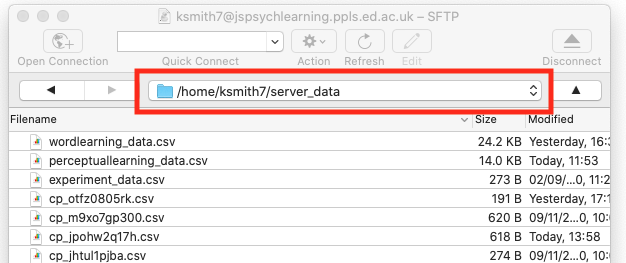

# The plan for week 8 practical

This week we are going to look at code for a confederate priming experiment based on the experiment described in Loy & Smith (2021) (and in fact using our stimuli). There's no new material to look at in the Online Experiments with jsPsych tutorial. The code we give you will record audio and save it to the server - you don't actually need to know how the audio recording code works, so you can treat that part as a black box, although the code is all commented up if you want to take a look. We are also going to add a few more bits and pieces involving randomisation (random participant IDs, random wait durations to simulate a human partner), we'll build a custom preload list to make sure our button images are preloaded before the experiment starts (using an alternative technique to the one used in the answer to one of the harder questions from last week), and finally I'll show how to load a trial list from a CSV file (handy if you want to use a pre-built trial list).


# Acknowledgments

I cobbled together some audio recording code for the online experiments in another confederate priming paper, Loy & Smith (2020), which we then used for Loy & Smith (2021); Annie Holz then jsPsych-ified it ([she has her own audio recording demo](https://experiments.ppls.ed.ac.uk/)), and I tweaked that code for this demo experiment.

For this demo experiment we are using audio stims recorded by my RA Rachel Kindellan, who was the confederate in Loy & Smith (2021). The images are the ones we used in the experiments described in the paper.

# A confederate priming experiment

## First: you build (some of) it!

As with last week, we'd like to give you an opportunity to try to build (parts of) this experiment yourself, and we'll provide you with a template that we pre-built for you so you can focus on the more interesting parts of the experiment.

You need a bunch of files for this experiment - html and js files for several versions of the experiment, *two* php files (for saving CSV and audio data, and also reading in trial lists), plus various folders containing images, sounds, trial lists etc. Again, rather than downloading them individually, download the following zip file:
- <a href="code/confederate_priming.zip" download> Download confederate_priming.zip</a>

As usual, extract this and copy the folder into your practicals folder on the jspsychlearning server - since data (including audio) won't save if you run it locally, by this point you really want to be at least testing everything on the server. Furthermore, there are a couple of things to note before you can run our implementation of the code:
- Our code will save audio files to a subfolder of `server_data` called `audio` - so you need to create that subfolder. You can create new folders in cyberduck quite easily, but you have to create this new folder in exactly the right way to make sure the folder permissions (rules about who can write to the folder) are set correctly, otherwise your audio won't save. Go to your `server_data` folder in cyberduck and go into the folder (i.e. double-click it) so your cyberduck window looks like this - note that my navigation bar shows me I am in `/home/ksmith7/server_data`, yours will show you as in `/home/UUN/server_data` depending on what your UUN is.

Then click the "action" button (with the cog), select the "New folder..." option and call the new folder `audio` (with that exact name, i.e. lower-case first letter). That should create a folder in the correct place with the correct permissions!
- You may need to use Chrome for the audio recording to work reliably - feel free to try out other browsers, but if the audio recording doesn't work, try it in Chrome first before seeking our help!

If your directory structure is as I have been using so far, where all the exercises are in a folder called `online_experiments_practicals`, then the url for your implementation will be https://jspsychlearning.ppls.ed.ac.uk/~UUN/online_experiments_practicals/confederate_priming/my_confederate_priming.html and the URL for the final implementation will be https://jspsychlearning.ppls.ed.ac.uk/~UUN/online_experiments_practicals/confederate_priming/confederate_priming.html

If you run through our implementation of the experiment you'll see that the experiment consists of two trial types, which alternate:

- Picture selection trials, where participants hear audio from their partner (in fact, pre-recorded audio from our confederate) and select the matching picture from an array of 2 pictures.
- Picture description trials, where participants see two pictures side by side and produce a a description for one of them (the target) for their partner, clicking a mic icon to start and stop recording.

We are interested in whether, on critical trials featuring an opportunity to produce an unnecessary colour word, the descriptions produced by the confederate (which consistently overspecify or avoid overspecifying) influences the descriptions the participant produces.

Implementing something like this in full involves some technical steps you haven't seen yet, in particular recording audio and displaying stimuli which consist of pairs of images. jsPsych actually provides some plugins for audio responses but we prefer not to use them (we have our own code that we prefer). So instead of trying to implement this experiment in full, recording audio and all, feel free to see if you can get something that looks along the right lines (hearing the confederate speak and selecting from two pictures; seeing a picture and clicking a mic button) without worrying about the behind-the-scenes stuff with the audio recording at this point. And if you'd rather just jump to our implementation to see how we do it, that's fine.

The sound files and images you will want to play around with are in the `sounds` and `images` folders that you get in the zip file. Note that the audio and image files have quite abstract names - this was something that Jia came up with that made it easy for her to manage a large list of image files. You can look in the images and sounds folders to work this out, but to help you:

For images:

Faces: "f_fr1" is **f**emale face, **fr**ightened emotion, face number **1** (we have several faces for each emotion); "f_ha2" is happy female face number 2. Male faces start with "m_" rather than "f_" - e.g. "m_fr3" would be frightened male face number 3.

Fruit and veg: these are named "frv1" (apple) through to "frv16" (watermelon).

Animals: these are named "ani1" (camel) through to "ani16" (zebra).

Garments: These are one of our two sets of critical items which differ in colour. "g4_c1" is garment 4 (a sock) in colour 1 (red); "g2_c3" is garment 2 (a glove) in colour 3 (green).

Kitchen items: This is our other set of critical items. "k1_c1" is kitchen item 1 (a bowl) in colour 1 (red); "g2_c2" is kitchen item 2 (a fork) in colour 2 (blue).

For sounds:

The sound files are all matched to the image files of the same name - e.g. the image file "g4_c1" has some corresponding sound files whose name starts with "g4_c1" where Rachel (our confederate) says "the red sock". But to inject a bit of variation and make it less obvious these are pre-recorded, we have several versions of some sound files - e.g. there are two recordings of Rachel saying "the red sock", which are named "g4_c1_1" and "g4_c1_2". We also have sound files with just the bare noun (e.g. "the sock" rather than "the red sock"), e.g. "g4_1" and "g4_2" are Rachel saying "the sock" a couple of different ways. 

## Our implementation

There are actually two implementations of the experiment included in the zip file for you:
- A short version with a small number of trials. The code for this is in `confederate_priming.html` and `confederate_priming.js`, and the URL will be https://jspsychlearning.ppls.ed.ac.uk/~UUN/online_experiments_practicals/confederate_priming/confederate_priming.html if your directory structure is as suggested in previous weeks. This is the code I will start with in the explanation below.
- A full-length version with a large number of trials (100+). The code for this is in `confederate_priming_readfromcsv.html` and `confederate_priming_readfromcsv.js`, and the URL should be https://jspsychlearning.ppls.ed.ac.uk/~UUN/online_experiments_practicals/confederate_priming/confederate_priming_readfromcsv.html. If you want a longer demo you can run this, but the main purpose of including the second version is to show you how a long trial list can be read in from a CSV file.

Picture selection trials in our implementation work in essentially the same way as picture selection trials in the perceptual learning experiment, using the `audio-button-response` plugin. Picture description trials are a series of `html-button-response` trials (with the participant clicking on a mic button to start and stop recording), with some additional infrastructure to handle recording audio. Picture description trials involve presenting two side-by-side images, one highlighted with a green box, and it turns out it is easier to do this using the `html-button-response` plugin than it is using the `image-button-response` plugin - this is explained below!

We also simulate the confederate preparing to speak and making a selection based on the participant's productions by inserting variable-duration delays at appropriate points. The full experiment also included disfluencies etc (you can see some of the sound files for those if you go digging in the `sounds` folder) but we'll keep it simple here.

The code therefore uses plugins you are already familiar with - the main new addition to the code is some functions which record audio, but you don't actually need to know how this works (although the code is there for you to look if you are interested), and a bit of trickery to get two images displayed side by side as a stimulus (which is actually quite easy).

### Loading the code for recording audio

Rather than putting all the audio recording code plus all the other experiment code in one long js file, I have split it - the audio recording code is in `confederate_priming_utilities.js`, which we load in our `confederate_priming.html` file at the same time as specifying the plugins etc we need and loading the `confederate_priming.js` file.

```html
<script src="confederate_priming_utilities.js"></script>
<script src="confederate_priming.js"></script>
```

The browser doesn't actually care if code is split over more than one file - it reads them in one after another, so variables and functions created in one file are accessible in code in another file. Splitting the code in this way makes for code that's easier to work with and also conceptually cleaner, in that you parcel off one set of functions (in this case, for recording audio) into its own file. That also makes it easy to reuse that code elsewhere - I have various experiments involving audio recording that all use essentially the same utilities file.

For our purposes all you have to know is that `confederate_priming_utilities.js` creates some variables and functions that we can use in our main experiment code. These are:

`recording_counter`, which is just a counter where we keep track of how many audio recordings we have made - the first recording is 0, the second 1 etc. We use these in the filenames of recordings and also in the CSV data saved on the server so that we can link particular recordings to particular experiment trials. jsPsych actually already creates a trial_index variable that we could use to keep track of this, but I found it very confusing if the first audio had index 11, the second had index 15 etc, so I set up this additional counter. 

`request_mic_access()`, which is a function which creates the various media and recorder objects we need to record audio, and will prompt the participant for mic access via a pop-up.

`start_recording(filename_prefix)`, which is a function that starts audio recording from the participants' mic. When the audio recording stops, the audio will be saved
to a file on the server (in `server_data/audio`) called filename_prefix_recording_counter.webm - e.g. if you pass in filename prefix "kennyaudio" the first recording will be saved as kennyaudio_0.webm.

`stop_recording()` is a function which stops the current audio recording, triggering saving of the audio file, and also increments the `recording_counter` so that the next recording has a different counter value and therefore a different file name.

### Random participant IDs and random delays

The first part of `confederate_priming.js` is comments on the audio recording code (for human reading, the code ignores these) and then some code for saving our data trial by trial - the function `save_confederate_priming_data` saves trial data in the same way as the `save_perceptual_learning_data` function from last week, and you'll see it used in the functions below. Since you have seen similar functions before, I'll skip these - there is a little bit of added complexity in there in that we want to record slightly different data for our two trial types, but you can look at the code and comments if you are interested.

The next thing in the code is a couple of functions for handling random elements of the experiment.

First, we are going to assign each participant a random participant ID - this means we can save one CSV file and one set of audio recordings per participant, rather than cramming everything into a single file as we have been doing so far. We create these random IDs using a jsPsych built-in function:

```js
var participant_id = jsPsych.randomization.randomID(10);
```

This creates a variable, `participant_id`, which we can use later. The participant IDs are a string of randomly-generated letters and numbers, in this case set to length 10 (e.g. "asqids6sn1") - since there are many many possible combinations of length 10 (36 to the power 10, which is more than 3,600,000,000,000,000) in practice this should mean that no two participants are assigned the same ID, and therefore each participant has a unique ID. Depending on how you set up your experiment, on some crowdsourcing platforms you might want to access the participant's platform-specific ID rather than generating a random one (e.g. every participant on Prolific has a unique ID), we'll show you how to do that in the final week of the course, it's easy. But for now we'll just generate a random ID per participant.

At various points in the experiment we also want to create a random-length delay, to simulate another participant composing their description or selecting an image based on the genuine participant's description. In the Loy & Smith (2021) paper we had a fairly intricate system for generating these random delays, making them quite long initially (to simulate a partner who was not yet used to the task) and then reducing over time (to simulate increasing familiarity, but also not to needlessly waste our real participants' time); we also inserted various kinds of disfluencies, particularly early on. My impression is that this was reasonably successful - we have run a number of experiments with this set-up and not too many participants guessed they were interacting with a simulated partner - and also worth the effort, in that most of the people who *did* guess that they were not interacting with a real person were cued by their partner's response delays, in particular, noting that they were quite short and quite consistent.

In the demo experiment, for simplicity's sake we just create a function which returns a random delay between 1800ms and 3000ms, using some built-in javascript code for random number generation:

```js
function random_wait() {
  return 1800+(Math.floor(Math.random() * 1200))
}
```

`Math.random()` generates a random number between 0 and 1 (e.g 0.127521, 0.965341). We then multiply that by 1200 and use `Math.floor` to round down to a whole number (e.g. our random numbers will become 255, 1130 respectively), then add 1800ms to produce random waits in our desired range (e.g. 2055ms, 2930ms).

### Picture selection trials

Now we are in a position to start coding up our main trial types. We'll start with picture selection trials, which work in a very similar way to picture selection trials in the perceptual learning experiment - participants hear some audio and then click on an image button, which is pretty straightforward using the `audio-button-response` plugin. The only added complication here is that we want to simulate another person thinking for a moment before starting their description. Unfortunately there's no built-in way to do this within the `audio-button-response` plugin - I was hoping for a `delay_before_playing_audio` parameter or something, but there's no such thing. The solution is to have a sequence of two trials that looks like a single trial - one trial where nothing happens (to simulate the wait for the confederate to speak), then the actual `audio-button-response` trial where we get the audio from the confederate. I built these both using the `audio-button-response` trial - on the waiting trial we just play a tiny bit of silence as the `stimulus` (the plugin won't allow us to have *no* sound, so this was the closest I could get) and wait for a random duration, ignoring any clicks the participant makes, then we move on and play the confederate audio.  

As usual, we'll write a function where we specify the main parts of the trial (the audio file the participant will hear, which I am calling `sound`; the target image, the foil or distractor image) and then the function returns a complex trial object for us. Here's the full chunk of code, I'll walk you through it piece by piece below:  

```js
function make_picture_selection_trial(sound, target_image, foil_image) {
  //add target_image and foil_image to our preload list
  images_to_preload.push(target_image);
  images_to_preload.push(foil_image);

  //create sound file name
  var sound_file = "sounds/" + sound + ".wav";

  //generate random wait and random order of images
  var wait_duration = random_wait();
  var shuffled_image_choices = jsPsych.randomization.shuffle([
    target_image,
    foil_image,
  ]);

  //trial for the delay before the partner starts speaking
  var waiting_for_partner = {
    type: jsPsychAudioButtonResponse,
    stimulus: "sounds/silence.wav",
    prompt: "<p><em>Click on the picture your partner described</em></p>",
    choices: shuffled_image_choices,
    trial_duration: wait_duration,
    response_ends_trial: false, //just ignore any clicks the participant makes here!
    button_html:
      '<button class="jspsych-btn"> </button>',
  };
  //audio trial
  var selection_trial = {
    type: jsPsychAudioButtonResponse,
    stimulus: sound_file,
    prompt: "<p><em>Click on the picture your partner described</em></p>",
    choices: shuffled_image_choices,
    button_html:
      '<button class="jspsych-btn"> </button>',
    post_trial_gap: 500, //a little pause after the participant makes their choice
    on_start: function (trial) {
      trial.data = {
        participant_task: "picture_selection",
        button_choices: shuffled_image_choices,
      };
    },
    on_finish: function (data) {
      var button_number = data.response;
      data.button_selected = data.button_choices[button_number];
      save_confederate_priming_data(data); //save the trial data
    },
  };
  var full_trial = { timeline: [waiting_for_partner, selection_trial] };
  return full_trial;
}
```

First, we need to do some book-keeping. 

We add the images we are going to show to a list we are building up, called `images_to_preload` - I will say what this is for when I talk about preloading later!

```js
  //add target_image and foil_image to our preload list
  images_to_preload.push(target_image);
  images_to_preload.push(foil_image);
```

We add the path for the sound file (all our sound files are in the `sounds` directory and have `.wav` on the end)

```js
  //create sound file name
  var sound_file = "sounds/" + sound + ".wav";
```

We then do some randomisation stuff: we generate a random wait using our `random_wait` function (for the period of silence before the confederate starts speaking), and we shuffle the order in which the two images will be displayed on-screen. Note that we are doing this here, when we create the trial, rather than in the `on_start`, because our picture selection trial is actually going to have a sequence of two trials in it, and we want them to have the pictures in the same order (it would be super-weird if the order of the images flip part-way through the trial!). There are several ways this could be achieved, I thought this was the simplest.

```js
  //generate random wait and random order of images
  var wait_duration = random_wait();
  var shuffled_image_choices = jsPsych.randomization.shuffle([
    target_image,
    foil_image,
  ]);
```


Our random wait is then an `audio-button-response` trial, where the participant sees the two image buttons on screen, but we ignore anything they click on (`response_ends_trial` is set to false), and we set `trial_duration` to the random wait we generated earlier. As in the perceptual learning experiment, we are using the `button_html` parameter to make our buttons appear as images rather than text.

```js
  //trial for the delay before the partner starts speaking
  var waiting_for_partner = {
    type: jsPsychAudioButtonResponse,
    stimulus: "sounds/silence.wav",
    prompt: "<p><em>Click on the picture your partner described</em></p>",
    choices: shuffled_image_choices,
    trial_duration: wait_duration,
    response_ends_trial: false, //just ignore any clicks the participant makes here!
    button_html:
      '<button class="jspsych-btn"> </button>',
  };
```

Our actual selection trial requires quite a large block of code to generate it (see the big chunk of code above, where we create `selection_trial`), but this is all stuff you have seen before - an `audio-button-response trial`, where we add some stuff the the trial data `on_start`, and then work out which button the participant actually clicked `on_finish`, saving the trial data to the server using the `save_confederate_priming_data` function. 

Finally, we stick our waiting trial and our picture selection trial together as a single trial consisting of just a timeline and returning that two-part trial.:

```js
var full_trial = {timeline:[waiting_for_partner,selection_trial]};
return full_trial
```

### Picture description trials

Next we create our picture description trials - remember, for these the participant sees two images side by side, with the target highlighted by a green box, clicks a button to start recording a description, clicks again to stop recording, and then "waits for their partner to make a picture selection" based on their description (in reality, the participant just gets a waiting message and waits for a random time). This can be achieved with a 3-part timeline: the initial part of the trial where the participant sees the pair of images and clicks a button to start recording, then the second part where they speak and then click again to stop recording, then the random wait. 

That sounds reasonably straightforward, but we have a slight issue in that we want to show *two* images side by side, and the `image-button-response` plugin (which seems like the obvious one to use) is designed to show a single stimulus. There are a couple of ways around this. We could write our own plugin that shows two images (but that sounds relatively complicated); we could make a whole bunch of image files that contain two images side by side (but given the number of images we have that will be a *huge* number of images!); or we can use another more flexible plugin. 

In the end I went for the 3rd option: I use `html-button-response` as my main plugin, since it allows the `stimulus` to be any html string, and since html can include images that means I can create an html stimulus that contains two images side by side. For example, if I want to show two images (imagine they are called them `image1.png` and `image2.png`) side by side in html then this will work:

```js
var composite_image =" "; 
```

That's a valid piece of html that uses image tags to include two images in a single piece of html, and it will work fine as the stimulus for an `html-button-response` trial. If we want to make the images the same size and add a green box around one of them (to identify it as the target) then we need slightly more complex html, but the same idea:

```js
var composite_image =" ";
```

The extra stuff sets the image width (you have seen that before) and the border (it took me a while and quite a lot of googling and trial-and-error to figure that out).

Again, we write a function which builds this complex trial for us - we pass in the target image to be described plus the foil image, it returns the complex trial for us. The full code is here, I'll walk you through it below:

```js
function make_picture_description_trial(target_image, foil_image) {
  //add target_image and foil_image to our preload list
  images_to_preload.push(target_image);
  images_to_preload.push(foil_image);

  //generate random wait and random order of images
  var wait_duration = random_wait();
  var shuffled_images = jsPsych.randomization.shuffle([
    target_image,
    foil_image,
  ]);
  var left_image = shuffled_images[0];
  var right_image = shuffled_images[1];
  //need to highlight the target with a green border - first need to work out whether
  //the target is on the left or the right!
  if (left_image == target_image) {
    var composite_image =
      " ";
  } else {
    var composite_image =
      " ";
  }
  var picture_plus_white_mic = {
    type: jsPsychHtmlButtonResponse,
    stimulus: composite_image,
    prompt: "<p><em>Describe the picture in the green box</p></em>",
    choices: ["mic"],
    button_html:
      '<button class="jspsych-btn" style="background-color: white;"> </button>',
  };
  var picture_plus_orange_mic = {
    type: jsPsychHtmlButtonResponse,
    stimulus: composite_image,
    choices: ["mic"],
    prompt: "<p><em>Describe the picture in the green box</p></em>",
    button_html:
      '<button class="jspsych-btn" style="background-color: Darkorange;"> </button>',
    on_start: function (trial) {
      trial.data = {
        participant_task: "picture_description",
        target: target_image,
        distractor: foil_image,
      };
      start_recording(participant_id);
    },
    on_finish: function (data) {
      data.recording_counter = recording_counter;
      stop_recording();
      save_confederate_priming_data(data);
    },
  };
  var waiting_for_partner = {
    type: jsPsychHtmlButtonResponse,
    stimulus: "Waiting for partner to select",
    choices: [],
    trial_duration: wait_duration,
    post_trial_gap: 500, //short pause after the confederate makes their selection
  };
  var full_trial = {
    timeline: [
      picture_plus_white_mic,
      picture_plus_orange_mic,
      waiting_for_partner,
    ],
  };
  return full_trial;
}
```

Let's step through that chunk by chunk. First we do some book-keeping - as with the picture selection trials, we keep track of image names for later preloading...

```js
  //add target_image and foil_image to our preload list
  images_to_preload.push(target_image);
  images_to_preload.push(foil_image);
```

...and we generate a random wait (for the screen at the end) and a random ordering of our target and foil images.

```js
  //generate random wait and random order of images
  var wait_duration = random_wait();
  var shuffled_images = jsPsych.randomization.shuffle([
    target_image,
    foil_image,
  ]);
```

But once we have generated that random ordering, we need to figure out whether the target image ended up on the left or the right, because we need to draw a green box around the target. To do that we split our `shuffled_images` into the `left_image` (the first, or 0th thing in the list since javascript counts from 0) and the `right_image` (the second, or 1st thing in the list):

```js
  var left_image = shuffled_images[0];
  var right_image = shuffled_images[1];
```

Now we can build our composite image as an html strng, using the same technique as above, but we can work out whether we need to draw a box around the left or right image by looking to see whether the left image is the target or not, using an if statement:

```js
if (left_image == target_image) {
    var composite_image =
      " ";
  } else {
    var composite_image =
      " ";
  }
```

That looks a bit scary, but it is just building an html string in the same way as the simpler example above, and specifying the box on the first image if that's the target, the second image otherwise.

Now we have the first sub-trial where the participant sees the composite image plus a "start recording" button and clicks to begin recording. This is just an `html-button-response` trial:

```js
var picture_plus_white_mic = {
    type: jsPsychHtmlButtonResponse,
    stimulus: composite_image,
    prompt: "<p><em>Describe the picture in the green box</p></em>",
    choices: ["mic"],
    button_html:
      '<button class="jspsych-btn" style="background-color: white;"> </button>',
  };
```

The participant's `choices` on this trial is just the mic button - we use the `mic` image file, which is in the `images` folder, and do a little bit of formatting in `button_html` so the mic image appears with a white background (which we'll change below to orange to indicate they are recording).

When the participant is ready they click the mic button, which progresses them to the next trial. This is where the action happens: we have to indicate they are recording (which we do by turning the mic button orange), actually start the recording, and then when they click the mic button again we have to stop the recording and save the trial data. The code for all that looks like this:

```js
  var picture_plus_orange_mic = {
    type: jsPsychHtmlButtonResponse,
    stimulus: composite_image,
    choices: ["mic"],
    prompt: "<p><em>Describe the picture in the green box</p></em>",
    button_html:
      '<button class="jspsych-btn" style="background-color: Darkorange;"> </button>',
    on_start: function (trial) {
      trial.data = {
        participant_task: "picture_description",
        target: target_image,
        foil: foil_image,
      };
      start_recording(participant_id);
    },
    on_finish: function (data) {
      data.recording_counter = recording_counter;
      stop_recording();
      save_confederate_priming_data(data);
    },
  };
```

A bunch of stuff is the same as in the `picture_plus_white_mic` trial - the image, its size, the mic button, the prompt - so there is no big visual change for the participant. But a couple of things are different.

First, we change the background colour of the mic image to orange, so the participant can see their click had an effect and they are now recording. This is done in the `button_html` parameter, where we set the mic button background to dark orange.

```js
button_html:'<button class="jspsych-btn" style="background-color: Darkorange;"> </button>',
```

Next, the trial has an `on_start` function, where (as well as adding information to the trial data that this is a picture description trial and note what the target and foil images were) we use the `start_recording` function to start recording from the participant's mic. Remember, this function is defined in our `confederate_priming_utilities.js` file, and we specify the name of the file where we want the audio saved - here we are using the participant's ID (which we created earlier and stored in the variable `participant_id`), so that each participant's audio will be recorded in easily-identified and separate sets of files:

```js
on_start: function (trial) {
      ...
      start_recording(participant_id);
    },
```

Finally, when the participant is done talking they click the mic button again to stop recording - so in this trial's `on_finish` parameter (which runs when they click the mic button) we stop the recording using our `stop_recording()` function.

```js
on_finish: function(data) {
  ...
  stop_recording();
  ...
}
```
 We also want to save the data from this trial, which we do using `save_confederate_priming_data`. But when we do that, we want to keep a note of `recording_counter` (which is our internal counter of recording numbers), so that when it comes time to listen to the recordings we can link the audio recording files (which include `recording_counter` in their name) with the specific trial in the experiment. To do that, we make a note of `recording_counter` in our trial data (note that we do that *before* we stop the recording, because `stop_recording` increments `recording_counter` in preparation for the next recording), then save that data.

 ```js
 on_finish: function(data) {
 data.recording_counter = recording_counter
 ...
 save_confederate_priming_data(data)}
 ```

Finally, we add the third sub-trial, a very simple waiting message using the random duration we generated earlier, and then build and return a trial with a nested timeline featuring our three trials (white mic, orange mic, waiting message):

```js
  var waiting_for_partner = {
    type: jsPsychHtmlButtonResponse,
    stimulus: "Waiting for partner to select",
    choices: [],
    trial_duration: wait_duration,
    post_trial_gap: 500, //short pause after the confederate makes their selection
  };
  var full_trial = {
    timeline: [
      picture_plus_white_mic,
      picture_plus_orange_mic,
      waiting_for_partner,
    ],
  };
  return full_trial;
}
```

### Building the interaction timeline

Now we can use these functions to build our timeline. We'll start by building a set of interaction trials, which alternate picture selection and picture description trials, then add the usual instructions etc later. Here's a set of 6 trials - the critical trials are 3 (the confederate describes a red sock using an overspecific description "the red sock") and 6 (the participant describes a red bowl - will they say "the red bowl", or just "the bowl"?). 

```js
var interaction_trials = [
  //filler (confederate describes face)
  make_picture_selection_trial("f_fr1", "f_fr1", "f_ha2"),
  //filler (participant describes fruit/vegetable)
  make_picture_description_trial("frv3", "frv12"),
  //critical trial (confederate describes red sock using adjective)
  make_picture_selection_trial("g4_c1_1", "g4_c1", "g2_c3"),
  //filler (participant describes animal)
  make_picture_description_trial("ani1", "ani15"),
  //filler (confederate describes face)
  make_picture_selection_trial("f_su3", "f_su4", "f_sa1"),
  //critical trial (participant describes red bowl)
  make_picture_description_trial("k1_c1", "k2_c2"),
];
```

We then combine `interaction_trials` with some information screens (including a detailed explanation for the participant on granting mic access) to produce the full experiment timeline.

### A custom preload list

As I mentioned in last week's practical, jsPsych's `preload` plugin will pre-load images and audio for certain trial types, which makes the experiment run more smoothly and ensures that images you think participants are seeing have actually been loaded and are displaying. In particular, the image in `image-button-response` trials and the audio in `audio-button-response` trials are preloaded automatically if you include a preload plugin and set `auto_preload: true`. However, that won't automatically preload images used as buttons in `audio-button-response` trials, which means our image buttons in picture selection trials will not be pre-loaded, and it doesn't preload anything for `html-button-response` trials, so our fancy composite images won't be preloaded either. Fortunately the `preload` plugin allows you to specify an additional list of images to be preloaded, which we will use to preload these button images. 

While we could manually code up a preload list (boring) or just load *all* the images we might need (a bit naughty since we are probably wasting the participant's bandwidth!), it's possible to get the code to construct this custom preload list for us. You might have attempted this last week, where we played around with working through a trial list and identifying images to preload. This week we are actually taking a slightly different approach: every time we build a trial, we make a note of the images we will need to preload. So right near the top of the `confederate_priming.js` file you'll find:

```js
//initially our images_to_preload list contains only 1 image, the microphone!
var images_to_preload = ["mic"];
```

That creates a variable where we can store a list of the images we will need to pre-load - we always need the microphone image, so that is in there. Then, as you have already seen, every time we call our functions which create trials for us, we add some images to this list using `push`. 

```js
function make_picture_selection_trial(sound, target_image, foil_image) {
  //add target_image and foil_image to our preload list
  images_to_preload.push(target_image);
  images_to_preload.push(foil_image);
...

function make_picture_description_trial(target_image, foil_image) {
  //add target_image and foil_image to our preload list
  images_to_preload.push(target_image);
  images_to_preload.push(foil_image);
```

So by the time we have created all our trials, our `images_to_preload` variable will contain a list of image names for preloading, which we can use in the `preload` plugin. Or almost - we have to do a little extra work, to add the path and file type information to each image name, which we do with a for loop. 

```js
var images_to_preload_with_path = [];
for (image of images_to_preload) {
  var full_image_name = "images/" + image + ".png";
  images_to_preload_with_path.push(full_image_name);
}

/*
Now we can make our preload trial
*/
var preload = {
  type: jsPsychPreload,
  auto_preload: true,
  images: images_to_preload_with_path,
};
```


### Advanced: reading the trial list from a CSV file

That's probably enough for one week, so if you feel you have learned enough for today you can skim this section very fast and not worry about the details - we'll actually cover something similar next week, so you'll have two opportunities to see this technique. But if you can take a bit more, read on! You don't have to master the details of this stuff, but getting the rough idea of how you read a trial list from a CSV might be useful.

The code above, which is in `confederate_priming.html` and `confederate_priming.js`, is perfectly adequate, and by adding more trials to `interaction_trials` you could fully replicate the Loy & Smith (2021) online experiments. However, the trial sequence in this experiment is pretty complex - as well as the correct sequence of primes, targets and fillers, we have to make sure we use all the objects and all the colours, get a mix of same-category and different-category prime-target fillers, and so on. For experiments with a complex trial sequence it's often useful to build trial lists in advance (either manually, which would be hard, or using whatever programming language you are comfortable with), and then load those trial lists into the experiment. 

If you look in the `trial_lists` folder you downloaded as part of the zip file for this week, you'll see a couple of CSV files containing trial lists - one for an overspecific confederate, and one for a minimally specific confederate. You would want many such files for a real experiment, to avoid your participants all seeing the same trial sequence, but to keep it simple I'll only show you two! Each line of those CSV files describes a trial: the participants role (in the column participantRole: director if they are proiducing the description, matcher if the confederate is speaking), the file name of the target and foil image (in the columns targetImage and distractorImage), and for trials where the confederate speaks the sound file to play (in soundFile) as well as some extra information telling us what trial type we are looking at (filler, prime or target) and the condition the file is for (overspecific or minimally specific).

We can read in these CSV files and use them to build a jsPsych trial list. That's what `confederate_priming_readfromcsv.html` and `confederate_priming_readfromcsv.js` do. Most of the code is the same as the basic `confederate_priming.js` code, but at the end you'll see some extra code for reading a CSV file into javascript and then converting it to a jsPsych trial list. The main function is `read_trials_and_prepare_timeline` - we specify  the file name for a trial list and it reads it, creates a timeline and then runs it. Then we can start the experiment by running something like:

```js
read_trials_and_prepare_timeline("overspecific_confederate.csv");
```

E.g. in this case, loading the overspecific confederate trial list. But how does this code work?

Reading a trial list from a CSV file in this way is slightly complicated, for two reasons. One reason is that we have to convert the text in the CSV file into something we can work with in javascript, which takes some time (the code contains two functions which do this, `read_trial_list` and `build_timeline`). But the other reason is that javascript behaves quite differently to other programming languages you may have used, in that it tries to run the code *synchronously* where it can - in other words, it doesn't necessarily wait for one function to finish before it starts the next function running. This isn't really noticeable unless you try running one function that is quite slow to execute *and* you need to use the output from that function as the input to another function, which is exactly what happens when we read a CSV file from the server. You might think we could do something like:

```js
var trial_list = read_trial_list(triallist_filename)
var interaction_trials = build_timeline(trial_list);
```
where `read_trial_list` gets the data from the CSV and then `build_timeline` turns it into a trial list that we can work with. However, this won't work. Getting data from a CSV file on the server takes some time - only a fraction of a second, so it appears instantaneous to us, but for the computer this is very slow. Rather than wait for the `read_trial_list` call to finish before it starts the `build_timeline` function running, the web browser will therefore press on and try to run `build_timeline`, but that will fail because the `trial_list` object which `build_timeline` needs as input doesn't actually contain any data yet, because `read_trial_list` hasn't finished!

How can we get around this problem? There are various solutions, but I think the simplest one is to use the `async` and `await` functions in newer versions of javascript. This allows us to declare some functions as `async` (i.e. asynchronous), and then use `await` to tell the browser to wait for a certain operation to complete before moving on. This means we can wait until the CSV file has been successfully read before we try to process the resulting data.  

That's how the `read_trials_and_prepare_timeline` function works - the full code is below, but this consists of the following steps:
- Read in the trial list from the CSV file using the `read_trial_list` function - we will `await` this result because we can't proceed without it. To keep the code as simple as possible the `read_trial_list` function is defined in a separate javascript file, `read_from_csv.js` - if you look at `confederate_priming_readfromcsv.html` you'll see we are loading this additional javascript file along with our plugins. You don't have to look at `read_from_csv.js` unless you want to - it's fine if you treat the process of reading in the CSV file as a black box, and we'll actually use a slightly different technique next week.  
- Use that trial list to build the interaction trials using the `build_timeline` function, which basically reads the relevant columns from the CSV and uses the `make_picture_selection_trial` and `make_picture_description_trial` functions we created earlier to make jsPsych trials.
- Build our image button preload list, which is just the same process as before but wrapped up in a function called `build_button_image_preload` so that it happens after we've made the trial list.
- Stick that interaction timeline together with the instruction trials to produce our full timeline.
- And then run the full timeline.

In code, these steps look like this:

```js
async function read_trials_and_prepare_timeline(triallist_filename) {
  var trial_list = await read_trial_list(triallist_filename);
  var interaction_trials = build_timeline(trial_list);
  var preload_trial = build_button_image_preload();
  var full_timeline = [].concat(
    consent_screen,
    audio_permission_instructions1,
    audio_permission_instructions2,
    preload_trial,
    write_headers,
    pre_interaction_instructions,
    interaction_trials,
    final_screen
  );
  jsPsych.run(full_timeline);
}
```

Being able to specify your trial list ahead of time and save it as a CSV file can be useful in general and is something we will use again next week.

## Exercises with the confederate priming experiment code

Attempt these problems.
- Run the basic `conferedate_priming.html` experiment and look at the CSV and audio data files it creates. Check you can access the audio, and that you can see how the audio and the trial list link up.
- Run it again and see where the data from the second run is stored - you may need to refresh your cyberduck window with the refresh button.
- The short trial list I built in `conferedate_priming.js` is for an overspecific confederate. How would you modify that trial list to simulate a minimally-specific confederate?
- Now try running the `conferedate_priming_readfromcsv.html` experiment - you don't have to work through the whole experiment, just a few trials! Again, check you can see your data on the server.
- For this version of the experiment, how do you switch from an overspecific to minimally-specific confederate? (Hint: this involves changing the name of the file used by the `read_trials_and_prepare_timeline` function in the very last line of the code).
- Building on the previous question: how would you randomly allocate a participant to one of these two conditions, overspecific or minimally specific? Once you have attempted this, you can look at [my thoughts on how it could be done](oels_practical_wk8_extended.md) (which also covers the harder question later on). 
- For either of these experiments, figure out how to disable image preloading for the button images and re-run the experiment. Can you see the difference? If it works smoothly, try running the experiment in Chrome in Incognito mode, which prevents your browser saving images etc for you. Can you see the difference now?
- [Harder, optional] Can you change the `random_wait` function so it generates longer waits early in the experiment and shorter waits later on? Once you have attempted this, you can look at [my thoughts on how it could be done](oels_practical_wk8_extended.md).


## References

[Loy, J. E., & Smith, K. (2020). Syntactic adaptation depends on perceived linguistic knowledge: Native English speakers differentially adapt to native and non-native confederates in dialogue. https://doi.org/10.31234/osf.io/pu2qa.](https://doi.org/10.31234/osf.io/pu2qa)

- [Loy, J. E., & Smith, K. (2021). Speakers Align With Their Partner's Overspecification During Interaction. *Cognitive Science, 45,* e13065.](https://doi.org/10.1111/cogs.13065)


## Re-use

All aspects of this work are licensed under a [Creative Commons Attribution 4.0 International License](http://creativecommons.org/licenses/by/4.0/).
